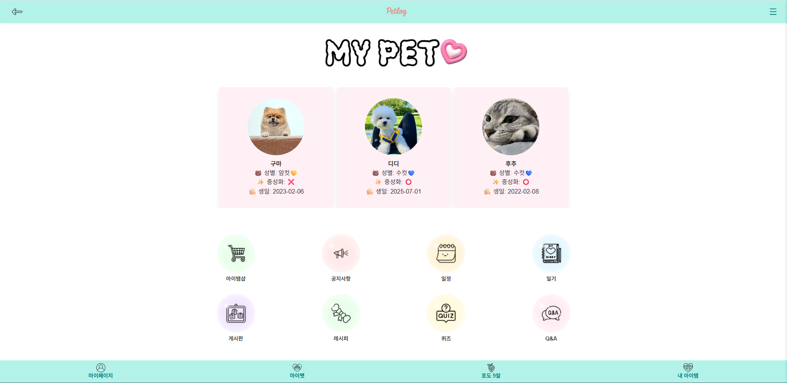
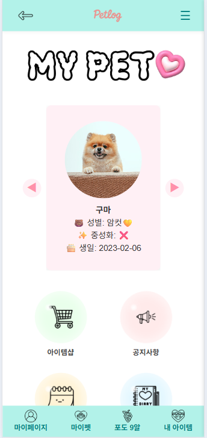

# 🐶 PetLog Web Project (Spring + Spring Boot 통합)

Java와 Spring Framework 기반으로 개발한 웹 애플리케이션입니다.  
초기에는 Spring MVC 구조로 시작하여, 이후 Spring Boot 기반으로 확장하며  
소셜 로그인, 회원 기능 개선, 반응형 UI 등 실제 서비스 수준으로 기능을 발전시켰습니다.

---

## 📁 프로젝트 구성

- `PetLog/` : Spring MVC 기반 팀 프로젝트
- `PetLog_Boot/` : Spring Boot 기반 리팩토링 및 기능 확장 버전
- `6조_PetLog_박다솜_창지수.pdf` : 팀 보고서

---

## 📌 주요 기능

### 팀 프로젝트 Spring & Spring Boot 공통 기능
- 반려동물 일기 작성 및 관리 기능 (펫 선택 후 개별 일기 등록)
- 일기와 캘린더 연동 기능 (날짜별 일기 조회 가능)
- 사용자 활동 점수 집계 및 등급/리스트로 관리되는 포도알 시스템
- 반려동물 정보 등록/수정/삭제 기능
- 일기 / 레시피 / 게시판 작성 시 포도알 적립 기능
- 간식 레시피 등록 및 조회 기능
- 포도알 아이템샵 기능 (아이템 구매, 착용, 사용 기록 포함)
- 공지사항 / 커뮤니티 게시판
- QnA 시스템 (문의 작성, 관리자 답변, 진행 상태 관리)
- 퀴즈 랜덤 출제 및 결과 저장 (정답 여부 판단, 풀이 시간 기록)
- 댓글, 좋아요, 조회수 기능 구현
- 회원가입, 로그인, 아이디/비밀번호 찾기
- 마이페이지 내 회원정보 수정 기능 (탈퇴 포함)
- 메인 페이지 디자인 구성 및 CSS 반응형 처리
- 전체 사이트 CSS 통일 및 모듈화 기반 UI/UX 리팩토링

## 🙋‍♀️ 맡은 역할 및 구현 내용
프로젝트 내에서 다음과 같은 핵심 기능들을 직접 설계 및 구현하였습니다.

### 🔐 회원 시스템
- 회원가입, 로그인, 로그아웃
- 아이디/비밀번호 찾기 (임시 비밀번호 이메일 발송)
- 마이페이지 기능: 회원 정보 수정, 비밀번호 변경, 회원 탈퇴

### 📝 커뮤니티 기능
- 공지사항 / 자유게시판 CRUD 구현
- 댓글, 좋아요, 조회수 기능 구현

### ❓ QnA 시스템
- 사용자 문의 작성
- 관리자 답변 등록
- 문의 상태값 변경(미답변 → 답변완료)

### 🎯 퀴즈 기능
- 퀴즈 랜덤 출제
- 정답 판단 및 풀이 시간 기록
- 정오답 결과 출력
- 

### 💫⭐ Spring Boot에서 확장된 기능
Spring 기반 프로젝트를 확장하며 실사용 수준의 기능을 강화했습니다.
- **카카오 로그인** (OAuth2 인증 연동)
- **회원 탈퇴 기능** (단순 삭제가 아닌 처리 로직 포함)
- **비밀번호 찾기** (임시 비밀번호 메일 발송)
- **로그인 사용자 기반 데이터 필터링**
  - 퀴즈 결과에서 로그인한 사용자 기준 정오답 출력
  - QnA 페이지에서 내가 쓴 문의글 리스트 별도 확인 가능
- **회원 등급 시스템 도입**
  - 유저 활동(글쓰기, 댓글, 퀴즈 등)에 따라 점수 산정
  - 누적 점수 기준으로 등급 표시 (예: 새싹포도 → 포도왕👑)
- **반응형 UI 구현**
  - 모바일 웹에 최적화된 뷰 구성
  - 해상도별 스타일 적용(CSS 미디어 쿼리)
- 전체 CSS 모듈화 및 UI 통일성 개선

---

## 📱 반응형 UI
PC 화면  

모바일 화면  

---

## 🛠 기술 스택

| 분야              | Spring Project                     | Spring Boot Project              |
|-------------------|------------------------------------|----------------------------------|
| Language          | Java                               | Java                             |
| Framework         | Spring MVC, Spring Security        | Spring Boot, Spring Security     |
| Template Engine   | JSP / JSTL                         | Thymeleaf                        |
| DB 연동           | MyBatis                            | Spring Data JPA                  |
| DB                | MySQL                              | MySQL                            |
| Build Tool        | Maven                              | Gradle                           |
| IDE               | Eclipse / IntelliJ IDEA            | IntelliJ IDEA                    |
| Version Control   | Git, GitHub                        | Git, GitHub                      |

---

## 🎯 추가 개선 및 보완 의지

- Spring 프로젝트에서 구현하지 못했던 기능(카카오 로그인, 회원 탈퇴, 회원 등급 등)을 Spring Boot 프로젝트에서 보완하였습니다.
- 향후 추가하고 싶은 기능:
  - 점수 + 활동지표 기반의 회원 등급 세분화
  - 댓글 좋아요 기능
  - 캘린더 일정 알림 기능
  - 내가 작성한 게시글에 대한 알림 기능 (댓글/좋아요 등)
  - 활동 이력 조회 기능
- 사용자 경험(UX)과 상호작용 강화를 중심으로 지속적으로 개선해나갈 계획입니다.

---

## ✨ 느낀 점

이번 프로젝트는 단순히 기능을 구현하는 것을 넘어,  
하나의 서비스를 구성하는 전체 흐름을 고민한 경험이었습니다.  

Spring MVC로 팀 프로젝트를 처음 시작할 땐 구조와 흐름을 익히는 데 집중했다면,  
Spring Boot로 리팩토링하면서는 **“왜 이렇게 나눠야 할까?”**,  
**“실제로 사용한다면 이 기능은 충분할까?”** 를 끊임없이 되물었습니다.  

특히 카카오 로그인(OAuth2) 연동이나 회원 등급 시스템,  
사용자 활동 필터링 기능을 구현하면서  
**데이터를 단순히 저장하는 것을 넘어 사용자 경험으로 이어지는 흐름**을 배우게 되었습니다.  

반응형 UI 구현도 단순한 CSS 문제가 아니라,  
**사용자가 어떤 기기로 접속하든 일관된 경험을 줄 수 있어야 한다**는 점에서  
개발자이자 디자이너로서의 책임을 함께 느꼈습니다.

앞으로는 RESTful API 설계, 테스트 코드, 배포 자동화 등  
지금 구현한 기능들을 **더 유연하고 단단하게 관리할 수 있는 방법**들을 학습해나가고 싶습니다.

---

## 📄 프로젝트 보고서(PDF)

-[6조 PetLog_박다솜,창지수.pdf 열기](./6조%20PetLog_%EB%B0%95%EB%8B%A4%EC%86%9C,%EC%B0%BD%EC%A7%80%EC%88%98.pdf)
